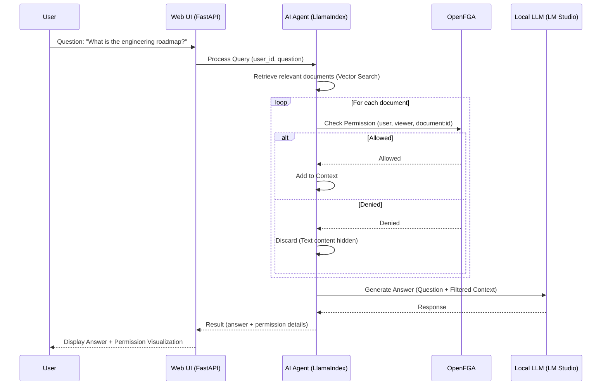

# Secure AI Agent with OpenFGA & LlamaIndex (Local LLM Version)

This is a sample application for a Lightning Talk (LT) demonstrating how to build an Authorization-aware AI Agent using **OpenFGA** and a **Local LLM** (via LM Studio).

## Architecture



## Prerequisites

1. **Docker**: To run the OpenFGA server.
2. **LM Studio**: Running locally with `ibm/granite-4-h-tiny` (or any other model) loaded.
   - **Server Port**: `1234` (Default)
   - **Start Server**: Ensure the local server is started in LM Studio.
3. **Python 3.10+**

## Setup

1. **Create and Activate Virtual Environment**

   ```bash
   python -m venv .venv
   source .venv/bin/activate
   ```

2. **Install Dependencies**

   ```bash
   pip install -r requirements.txt
   ```

3. **Set Environment Variables**
   Create a `.env` file in the project root with the following variables:

   ```bash
   # OpenFGA Configuration
   FGA_API_URL=http://localhost:8080
   FGA_STORE_ID=your_store_id_here  # Will be set after running fga_setup.py

   # Local LLM Configuration (LM Studio)
   LLM_API_BASE=http://127.0.0.1:1234/v1
   LLM_MODEL=ibm/granite-4-h-tiny
   LLM_API_KEY=lm-studio
   ```

   _Note: No OpenAI API Key is required. The `FGA_STORE_ID` will be generated when you run `fga_setup.py`._

4. **Start OpenFGA Server**

   ```bash
   docker run -d -p 8080:8080 -p 8081:8081 -p 3000:3000 openfga/openfga run
   ```

5. **Initialize Permissions**
   Run the setup script to create the store, model, and tuples.

   ```bash
   python fga_setup.py
   ```

   **IMPORTANT**: The script will output a `FGA_STORE_ID`. You must add this to your `.env` file or export it:

   ```bash
   export FGA_STORE_ID=...
   ```

## Running the Demo

### Web UI (Recommended for LT Demo)

The Web UI provides an interactive, visual demonstration of the authorization-aware AI agent.

1. **Start the Web Server**

   ```bash
   uvicorn api:app --reload --port 8000
   ```

2. **Open in Browser**

   ```
   http://localhost:8000
   ```

3. **Features**:
   - **User Selection**: Visual user cards with profile photos, roles, and group memberships
   - **Demo Scenarios**: Quick-test buttons for common queries (Engineering, Sales, Holidays, Merger)
   - **Flow Visualization**: Animated step-by-step visualization of the query process:
     - Question → Document Search → Permission Check → Use Only Allowed Documents → AI Answer
   - **Permission Check Results**:
     - Summary of allowed/denied documents
     - Detailed list with status indicators (✅ Allowed / ❌ Denied)
     - **Security**: Text content of denied documents is hidden (shows "[Access Denied]")
   - **AI Answer**: Highlighted answer section with enhanced styling
   - **Sidebar**: Real-time display of accessible documents per user, organized by folder
   - **Responsive Design**: Modern, clean UI with smooth animations

### Command Line Interface

For command-line usage and testing:

### Permission Model

We use **Groups** and **Folders** to manage permissions efficiently.

- **Groups**:
  - `group:engineering`: Alan, Tsuki, Seigen
  - `group:sales`: Tsukada, Seigen
- **Folders**:
  - `folder:engineering`: Contains Engineering docs. Viewable by `group:engineering`.
  - `folder:sales`: Contains Sales docs. Viewable by `group:sales`.
  - `folder:general`: Contains Public notices. Viewable by both groups.
  - `folder:executive`: Contains Merger Strategy. Viewable by Seigen only.

### Users

- **`user:seigen`** (CEO): Member of all groups + Direct access to Executive folder.
- **`user:alan`** (EM): Member of Engineering group.
- **`user:tsukada`** (CRO): Member of Sales group.
- **`user:tsuki`** (Backend): Member of Engineering group.

### Documents

The system includes 7 documents across different categories:

1. **Engineering Roadmap 2025** (Engineering, English)
2. **Sales Targets 2025** (Sales, English)
3. **Holiday Notice** (General, English)
4. **Project Alpha Specs** (Engineering, Japanese)
5. **Q4 Sales Report JP** (Sales, Japanese)
6. **Remote Work Policy** (General, Japanese)
7. **Merger Strategy** (Executive, English) - Confidential

### Examples

#### 1. Seigen asks about Engineering (Allowed)

```bash
python agent.py --user user:seigen --question "What is the engineering roadmap?"
```

#### 2. Tsukada asks about Engineering (Denied)

```bash
python agent.py --user user:tsukada --question "What is the engineering roadmap?"
```

#### 3. Tsuki asks about Sales (Denied)

```bash
python agent.py --user user:tsuki --question "What are the sales targets?"
```

#### 4. Everyone asks about Holidays (Allowed)

```bash
python agent.py --user user:alan --question "When is the office closed?"
```

## How it Works

### Core Components

1. **FGAPostprocessor** (`agent_api.py`): A custom LlamaIndex `BaseNodePostprocessor` that:

   - Filters retrieved documents based on OpenFGA permissions
   - Checks each document with `openfga_client.check(user, "viewer", document:id)`
   - Only passes authorized documents to the LLM
   - **Security Feature**: Returns "[Access Denied]" instead of actual text content for unauthorized documents

2. **Query Processing Flow**:

   - User submits a question through the Web UI or CLI
   - Vector search retrieves top-k relevant documents (default: 5)
   - For each document, OpenFGA permission check is performed
   - Only allowed documents are included in the LLM context
   - LLM generates answer using filtered context
   - Results include both the answer and detailed permission check results

3. **Web API** (`api.py`):
   - FastAPI-based REST API
   - Endpoints:
     - `POST /api/query`: Process queries with authorization
     - `GET /api/users`: Get list of users
     - `GET /api/documents`: Get list of all documents
     - `GET /api/permissions/{user_id}`: Get user's accessible documents

### Security Features

- **Text Content Protection**: Unauthorized documents' text content is never exposed in API responses
- **Permission-Based Filtering**: Documents are filtered before being sent to the LLM
- **Real-time Permission Checks**: Each query performs live permission checks via OpenFGA

## Project Structure

```text
llamaindex-fga-demo/
├── api.py                 # FastAPI web server and REST API
├── agent_api.py           # Core agent logic with FGAPostprocessor
├── agent.py               # Command-line interface
├── data.py                # Document data and metadata
├── fga_setup.py           # OpenFGA store initialization script
├── requirements.txt       # Python dependencies
├── static/
│   ├── index.html         # Web UI HTML
│   ├── css/
│   │   └── style.css      # Modern UI styles
│   ├── js/
│   │   └── app.js         # Frontend JavaScript
│   └── img/               # User profile photos
└── README.md              # This file
```
