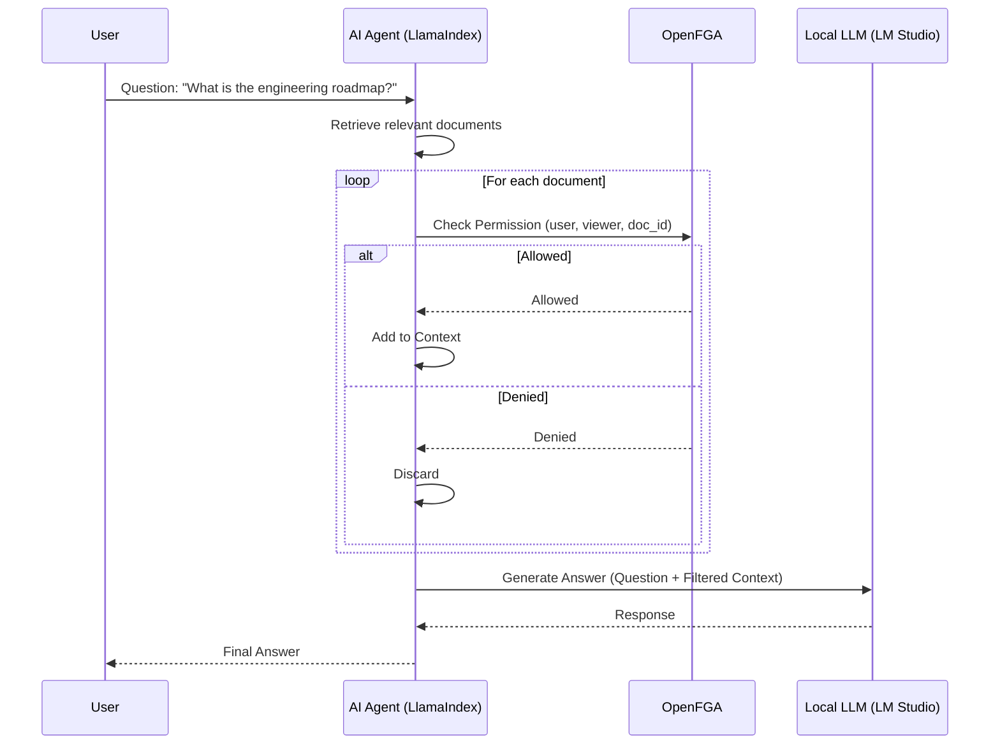

# Secure AI Agent with OpenFGA & LlamaIndex (Local LLM Version)

This is a sample application for a Lightning Talk (LT) demonstrating how to build an Authorization-aware AI Agent using **OpenFGA** and a **Local LLM** (via LM Studio).

## Architecture



## Prerequisites

1. **Docker**: To run the OpenFGA server.
2. **LM Studio**: Running locally with `ibm/granite-4-h-tiny` (or any other model) loaded.
   - **Server Port**: `1234` (Default)
   - **Start Server**: Ensure the local server is started in LM Studio.
3. **Python 3.10+**

## Setup

1. **Create and Activate Virtual Environment**

   ```bash
   python -m venv .venv
   source .venv/bin/activate
   ```

2. **Install Dependencies**

   ```bash
   pip install -r requirements.txt
   ```

3. **Set Environment Variables**
   Copy `.env.example` to `.env`.

   ```bash
   cp .env.example .env
   ```

   _Note: No OpenAI API Key is required._

4. **Start OpenFGA Server**

   ```bash
   docker run -d -p 8080:8080 -p 8081:8081 -p 3000:3000 openfga/openfga run
   ```

5. **Initialize Permissions**
   Run the setup script to create the store, model, and tuples.
   ```bash
   python fga_setup.py
   ```
   **IMPORTANT**: The script will output a `FGA_STORE_ID`. You must add this to your `.env` file or export it.
   ```bash
   export FGA_STORE_ID=...
   ```

## Running the Demo

### Web UI (Recommended for LT Demo)

For non-engineers and visual demonstrations, use the Web UI:

1. **Start the Web Server**

   ```bash
   uvicorn api:app --reload --port 8000
   ```

2. **Open in Browser**

   ```
   http://localhost:8000
   ```

3. **Features**:
   - Visual user selection with role and group information
   - Demo scenario buttons for quick testing
   - Real-time permission check visualization
   - Clear display of allowed/denied documents
   - Sidebar showing accessible documents per user

### Command Line Interface

For command-line usage:

We use **Groups** and **Folders** to manage permissions efficiently.

- **Groups**:
  - `group:engineering`: Alan, Tsuki, Seigen
  - `group:sales`: Tsukada, Seigen
- **Folders**:
  - `folder:engineering`: Contains Engineering docs. Viewable by `group:engineering`.
  - `folder:sales`: Contains Sales docs. Viewable by `group:sales`.
  - `folder:general`: Contains Public notices. Viewable by both groups.
  - `folder:executive`: Contains Merger Strategy. Viewable by Seigen only.

### Users

- **`user:seigen`** (CEO): Member of all groups + Direct access to Executive folder.
- **`user:alan`** (EM): Member of Engineering group.
- **`user:tsukada`** (CRO): Member of Sales group.
- **`user:tsuki`** (Backend): Member of Engineering group.

### Scenario (Enhanced Model)

We use **Groups** and **Folders** to manage permissions efficiently.

- **Groups**:
  - `group:engineering`: Alan, Tsuki, Seigen
  - `group:sales`: Tsukada, Seigen
- **Folders**:
  - `folder:engineering`: Contains Engineering docs. Viewable by `group:engineering`.
  - `folder:sales`: Contains Sales docs. Viewable by `group:sales`.
  - `folder:general`: Contains Public notices. Viewable by both groups.
  - `folder:executive`: Contains Merger Strategy. Viewable by Seigen only.

### Users

- **`user:seigen`** (CEO): Member of all groups + Direct access to Executive folder.
- **`user:alan`** (EM): Member of Engineering group.
- **`user:tsukada`** (CRO): Member of Sales group.
- **`user:tsuki`** (Backend): Member of Engineering group.

### Examples

**1. Seigen asks about Engineering (Allowed)**

```bash
python agent.py --user user:seigen --question "What is the engineering roadmap?"
```

**2. Tsukada asks about Engineering (Denied)**

```bash
python agent.py --user user:tsukada --question "What is the engineering roadmap?"
```

**3. Tsuki asks about Sales (Denied)**

```bash
python agent.py --user user:tsuki --question "What are the sales targets?"
```

**4. Everyone asks about Holidays (Allowed)**

```bash
python agent.py --user user:alan --question "When is the office closed?"
```

## How it Works

The `agent.py` uses a custom `FGAPostprocessor` (LlamaIndex NodePostprocessor).

1. It retrieves the top relevant documents for the query.
2. BEFORE sending them to the LLM, it checks `openfga_client.check()` for each document against the current user.
3. Only authorized documents are passed to the LLM for synthesis.
