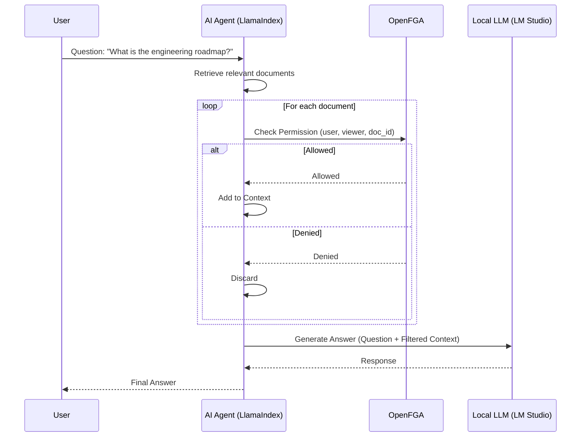

# Architecture Diagram

```mermaid
sequenceDiagram
    participant User
    participant Agent as AI Agent (LlamaIndex)
    participant FGA as OpenFGA
    participant LLM as Local LLM (LM Studio)

    User->>Agent: Question: "What is the engineering roadmap?"
    Agent->>Agent: Retrieve relevant documents
    
    loop For each document
        Agent->>FGA: Check Permission (user, viewer, doc_id)
        alt Allowed
            FGA-->>Agent: Allowed
            Agent->>Agent: Add to Context
        else Denied
            FGA-->>Agent: Denied
            Agent->>Agent: Discard
        end
    end

    Agent->>LLM: Generate Answer (Question + Filtered Context)
    LLM-->>Agent: Response
    Agent-->>User: Final Answer
```
